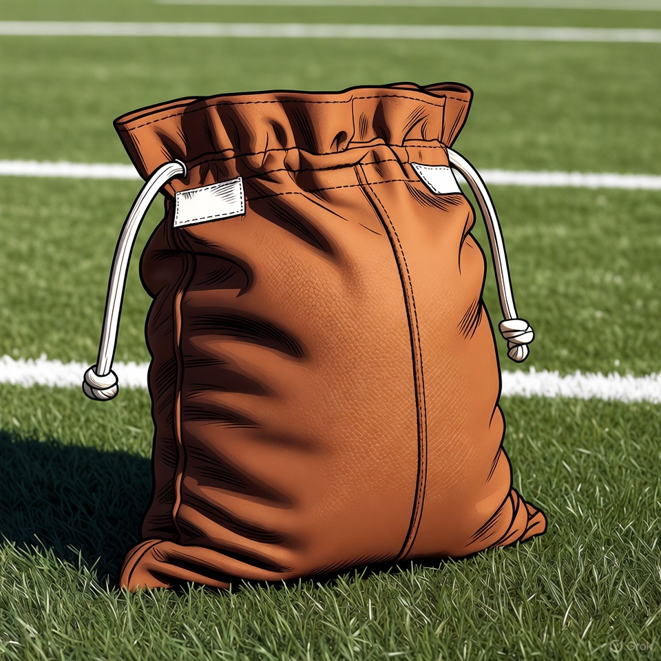

# Sackigami

This is a [X-bot](https://x.com/sackigami) (@sackigami) posting funny and unique NFL sack stats.

## Posted Stats

Currently, the following game stats are considered:

- Sacks suffered
    - The amount of sacks a team conceded during a game
- Sack yards lost
    - How many yards were lost in consequence of the sacks
- Strip-sacks
    - The amount of sacks that ended in a fumble
- Strip-sack fumbles lost
    - The resulting turnovers in consequence of strip sacks

Not every game will be posted,
the following requirements have to be met:

- Sackigami! The game stat combination has never been seen before (in the
available data)
- The combination is rare (i.e. occurred less than five times)
- The last time similar stats occurred 15 years or more ago
- The team conceded sacks without losing yards
- Any of the following
    - More than or equal to five sacks suffered
    - More than or equal to 35 yards lost on sacks
    - More than or equal to two strip-sacks
    - More than or equal to one turnover inducing strip-sack
